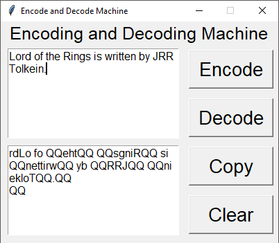

# The Secret Code Generator
## About:
An Encoding and Decoding machine where the sentence to be encoded is entered by the user and on clicking the right button the text is either encoded or decoded in a special form.
To know more check [how the encryption is working](working.md)

------------------------------------------
## How to Use?
#### To know how to use the Machine check out [User's Guide](Manual.md)

---------------------------------------------------

## Requirements:
Check the [Requirements](Requirements.md) File to know the details.

------------------------------------------
## Demo:

------------------------------------------
## Want to Contribute but stuck?
### Read the [Rules and Guidelines](Rules.md)
### Check [How to Contribute](how_to_contribute.md)
-------------------------------------------
## New To GitHub??
* [Intro to GitHub](https://youtu.be/wTTek8P2VB4)
* [How to Create a Repository](https://youtu.be/o6T5F7-SOAo)
* [Cloning a Repository](https://youtu.be/oYselL5G280)
* [Contributing to a Project](https://youtu.be/4vq07q7g2xE)
--------------------------------------------
## If you find this Repository Interesting and Helpful do leave a 🌟 or contribute. 😄