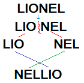
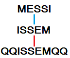

# The Encryption Technique:
- If a word in a sentence can be equally divided then it is divided first and then the last part comes front and the front part goes back to form a new word.

------------------------------------------------------
- If a word in a sentence cannot be equally divided then, the word is reversed and a double "q" is attached in front and double "q" in the back.

------------------------------------------------------
- The Numbers and Special Symbols stays same.

------------------------------------------------------